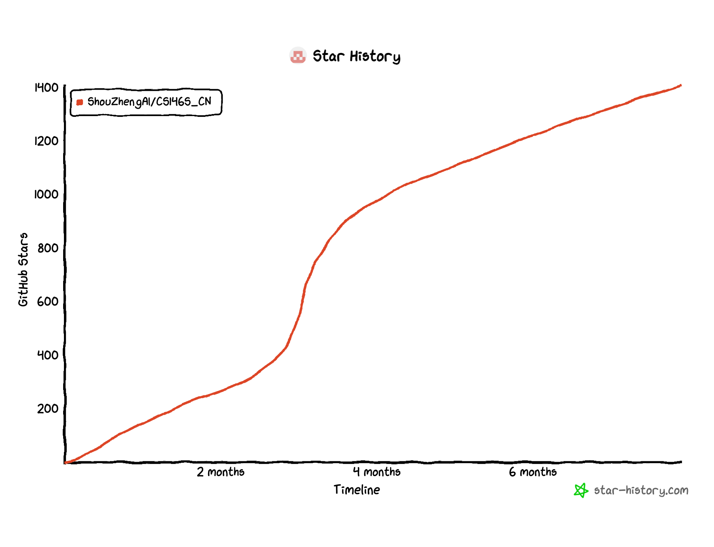

  

<h1 align="center">📚CS146S中文版课程 Vibe Coding Together</h1>

**欢迎加入 动手学CS146S 交流群一起讨论，若群二维码过期请添加个人微信**:

  ,

> 本项目长期维护，希望能帮到各位入门 vibe coding 的朋友，欢迎Star，分享与提PR🌟~  
> 正在积极维护高质量 Assignments 中，每周天发布哦~  
> 群内不定期分享由赞助商提供的大模型额度，欢迎进群

🌟 付费赞助广告位：联系邮箱szwang.scholar@gmail.com，在文档内展示您的品牌和产品。

---
<table>
<tr>
<td width="180"></a></td>
<td><a href="https://www.atlascloud.ai/zh?utm_source=github&utm_medium=link&utm_campaign=CS146S_CN">Atlas Cloud</a> is a full-modal AI inference platform that gives developers a single AI API to access video generation, image generation, and LLM APIs. Instead of managing multiple vendor integrations, you connect once and get unified access to 300+ curated models across all modalities..

Check out Atlas Cloud's new coding plan promotion for more budget-friendly API access：<a href="https://www.atlascloud.ai/console/coding-plan">coding-plan</a>
</td>
</tr>
</tr>

<tr>
<td width="180"></a></td>
<td>
感谢 APIMart 赞助了本项目！APIMart 是专注 AI 图片/视频生成的低价 API 平台，GPT-Image-2 低至 $0.006/张，1 美元可出图 160+ 张。图片、视频一套异步 API 通吃，提交任务拿 ID、回调取结果，跑批万张不超时、换模型不改代码。按量付费、无月费，通过此<a href="https://go.apimart.ai/gh-cs146s_cn">注册链接</a>注册即可开用。

</td>
</tr>
</tr>

</table>

## 课程简介

大语言模型（LLM）正在把软件开发从以人工编写代码为主的过程，转变为开发者与能力日益增强的 Coding Agent 协作的过程。这一变化要求我们用新的方式定义意图、组织工作，并协调工具，让 Agent 能够有效参与复杂的软件项目。

课程将探讨 AI 原生软件开发背后的新兴实践与技术，包括 MCP、Agent Skills、spec-driven development、loop engineering 和 software factory。你将学习如何为 Agent 提供合适的上下文与能力，把产品需求转换为可执行的规格，并设计由人类与 Agent 共同规划、构建、评估和迭代改进的工作流。

通过动手作业、项目和来自下一代开发工具实践者的分享，学生将了解当前 Coding Agent 的能力与局限。课程结束时，学生将能够设计有效的 Agent 驱动工作流，将工具与 Skills 组合成可靠的开发系统，并运用 software factory 的原则，以更高的速度和规模构建、演进软件。

**先决条件**：具备相当于 CS111 级别的编程经验。推荐具备 CS221/229 课程知识。

**形式**：每周讲座、动手编码实践课，以及行业嘉宾演讲。期末项目要求展示现代开发实践。

**目标**：掌握现代开发工具、理解 AI 辅助编程、学习自动化测试和部署、探索新兴软件趋势。

**评分**：期末项目 50%，每周作业 15%，开源贡献 5%，课堂参与 5%

* [教学大纲](#教学大纲)
    * [第 1 周：编码 LLM 和 AI 开发简介](#第-1-周编码-llm-和-ai-开发简介)
    * [第 2 周：编码智能体剖析](#第-2-周编码智能体剖析)
    * [第 3 周：AI 集成开发环境（IDE）](#第-3-周ai-集成开发环境ide)
    * [第 4 周：编码智能体模式](#第-4-周编码智能体模式)
    * [第 5 周：现代终端](#第-5-周现代终端)
    * [第 6 周：AI 测试与安全](#第-6-周ai-测试与安全)
    * [第 7 周：现代软件支持](#第-7-周现代软件支持)
    * [第 8 周：自动化 UI 和应用程序构建](#第-8-周自动化-ui-和应用程序构建)
    * [第 9 周：智能体部署后](#第-9-周智能体部署后)
    * [第 10 周：AI 软件工程的未来展望](#第-10-周ai-软件工程的未来展望)
* [本地ai应用](#本地应用)
* [vibe coding命令行工具](#命令行工具)
* [国产编程平台](#国产编程平台)
* [FAQ 常见问题](#常见问题)
* [相关资源-vibe coding项目](#相关项目资源)
---
- [x] week1 Assignments
- [ ] week2 Assignments
- [ ] week3 Assignments
- [ ] week4 Assignments
- [ ] week5 Assignments
- [ ] week6 Assignments
- [ ] week7 Assignments
- [ ] week8 Assignments  
- [ ] week9 Assignments
- [ ] week0 Assignments
---
## 教学大纲
### Fall 2026

| 周次     | 主题与要点                                                                                                                                                                                                                             | 课程安排                                                                                                                                                             |
| -------- | -------------------------------------------------------------------------------------------------------------------------------------------------------------------------------------------------------------------------------------- | -------------------------------------------------------------------------------------------------------------------------------------------------------------------- |
| 第 1 周  | **Coding Agent 的内部原理** • LLM 究竟是什么，以及 Agent loop 在底层如何运行 • 核心工具集（read、write、edit、bash）及任务如何在其中流转 • 生产级 Coding Agent 如何组织 system prompt 与工具定义                              | **9/22（周二）**：课程简介 + 用 200 行代码构建 Claude Code **9/24（周四）**：前沿 Coding Agent 的设计方式：深入剖析定义 Agent 的 system prompt                    |
| 第 2 周  | **高级 Context Engineering** • 高级 prompting 技巧及其适用场景 • RePPIT（Research、Propose、Plan、Implement、Test）与 spec-driven development • MCP 基础：server、client、tool 与 transport • 为 Agent ergonomics 设计工具 | **9/29（周二）**：高级 prompting + Agentic 开发框架（RePPIT、spec-driven development） **10/1（周四）**：MCP 与 tool calling 全面介绍（理论、配置与高级工具设计） |
| 第 3 周  | **Agent Skills 与 CLI** • Skills 是什么；SKILL.md + 脚本如何编码一个工作流 • Web Skills，以及如何把 Agent 能力扩展到 repo 之外 • 如何高效地通过 CLI 工作                                                                      | **10/6（周二）**：全面了解 Agent Skills（含 Web Skills） **10/8（周四）**：嘉宾：Lee Robinson（Cursor）                                                           |
| 第 4 周  | **定制你的 Agent 与仓库** • CLAUDE.md 与 AGENTS.md：各自应该写什么 • 用 Hooks 配置 lint gate、测试运行与 guardrail • Subagent 模式（planner / implementer / reviewer）                                                        | **10/13（周二）**：定制 Agentic 开发环境（CLAUDE.md、AGENTS.md、Hooks） **10/15（周四）**：嘉宾：Boris Cherny（Anthropic），炉边问答                              |
| 第 5 周  | **Agent 就绪的代码库** • 什么让 repo 对 Agent 友好：结构、文档、测试与检查机制 • 就绪度评分与审计 • 真实 repo 中阻碍 Agent 工作的常见缺口                                                                                     | **10/20（周二）**：让 repo 对 Agent 就绪：使仓库更 Agent-friendly 的结构、文档与检查机制 **10/22（周四）**：嘉宾：Eno Reyes，分享 Agent readiness                 |
| 第 6 周  | **Agentic Code Review** • AI 代码审查擅长发现什么、又会遗漏什么 • 审查架构与自定义规则 • 将 AI 审查融入团队的 PR 工作流                                                                                                       | **10/27（周二）**：Agentic Code Review：最佳实践与架构 **10/29（周四）**：嘉宾：Silas Alberti（Cognition）                                                        |
| 第 7 周  | **安全** • SAST / SCA、依赖漏洞与 Secret 泄露漏洞 • Prompt Injection 与 Agent 特有攻击面 • Agent 辅助的漏洞分诊与修复                                                                                                         | **11/3（周二）**：AI 代码库中的安全 **11/5（周四）**：嘉宾：Isaac Evans（Semgrep）                                                                                |
| 第 8 周  | **后台 Agent** • 异步、云端委派的 Agent • 管理并行 Agent 集群 • Issue-to-PR 流水线与触发器（Slack、Linear、GitHub）                                                                                                           | **11/10（周二）**：后台 Agent：异步启动任务 **11/12（周四）**：嘉宾（待公布）                                                                                     |
| 第 9 周  | **构建 AI 原生团队** • MCP 门户与集中化、权限化的工具访问 • LLM gateway、模型路由与成本优化 • 组织范围内的落地模式                                                                                                            | **11/17（周二）**：大型团队中的 Coding Agent（MCP 门户、LLM gateway、组织模式、成本优化与模型路由） **11/19（周四）**：嘉宾（待公布）                             |
| 第 10 周 | **Software Factory 与未来** • 可自行运行、自我改进的软件系统 • 部署后运行与保护 Agent • AI 软件工程的下一步                                                                                                                   | **12/1（周二）**：Software Factory：可自行运行、自我改进的软件系统 **12/3（周四）**：嘉宾（待公布）                                                               |

### Fall 2025

| 周次     | 主题与要点                                                                                                        | 阅读材料                                                                                                                                                                                                                                                                                                                                                                                                                                                                                                                                                                                                                                                                                                                                      | 作业                                                                                                                  | 课程安排                                                                                                                                                                                                                                                                                                                                                                                                                                                                                                                          |
| -------- | ----------------------------------------------------------------------------------------------------------------- | --------------------------------------------------------------------------------------------------------------------------------------------------------------------------------------------------------------------------------------------------------------------------------------------------------------------------------------------------------------------------------------------------------------------------------------------------------------------------------------------------------------------------------------------------------------------------------------------------------------------------------------------------------------------------------------------------------------------------------------------- | --------------------------------------------------------------------------------------------------------------------- | --------------------------------------------------------------------------------------------------------------------------------------------------------------------------------------------------------------------------------------------------------------------------------------------------------------------------------------------------------------------------------------------------------------------------------------------------------------------------------------------------------------------------------- |
| 第 1 周  | **Coding LLM 与 AI 开发导论** • 课程安排 • LLM 究竟是什么 • 如何有效 prompting                           | [深入理解 LLM](https://www.youtube.com/watch?v=7xTGNNLPyMI) [Prompt Engineering 概览](https://cloud.google.com/discover/what-is-prompt-engineering) [Prompt Engineering 指南](https://www.promptingguide.ai/techniques) [AI Prompt Engineering：深入解析](https://www.youtube.com/watch?v=T9aRN5JkmL8) [OpenAI 如何使用 Codex](https://cdn.openai.com/pdf/6a2631dc-783e-479b-b1a4-af0cfbd38630/how-openai-uses-codex.pdf)                                                                                                                                                                                                                                                                                                         | [LLM Prompting Playground](https://github.com/mihail911/modern-software-dev-assignments/tree/master/week1)            | **9/22（周一）**：LLM 简介及其构建原理 — [Slides](https://docs.google.com/presentation/d/1zT2Ofy88cajLTLkd7TcuSM4BCELvF9qQdHmlz33i4t0/edit?usp=sharing) **9/26（周五）**：LLM 的高效 prompting — [Slides](https://docs.google.com/presentation/d/1MIhw8p6TLGdbQ9TcxhXSs5BaPf5d_h77QY70RHNfeGs/edit?usp=drive_link)                                                                                                                                                                                                             |
| 第 2 周  | **Coding Agent 的剖析** • Agent 架构与组件 • 工具使用与 function calling • MCP（Model Context Protocol） | [MCP 简介](https://stytch.com/blog/model-context-protocol-introduction/) [MCP Server 示例实现](https://github.com/modelcontextprotocol/servers) [MCP Server 身份验证](https://developers.cloudflare.com/agents/guides/remote-mcp-server/#add-authentication) [MCP Server SDK](https://github.com/modelcontextprotocol/typescript-sdk/tree/main?tab=readme-ov-file#server) [MCP Registry](https://blog.modelcontextprotocol.io/posts/2025-09-08-mcp-registry-preview/) [关于 MCP 的思考](https://www.reillywood.com/blog/apis-dont-make-good-mcp-tools/)                                                                                                                                                                        | [AI IDE 初探](https://github.com/mihail911/modern-software-dev-assignments/tree/master/week2)                         | **9/29（周一）**：从零构建 Coding Agent — [Slides](https://docs.google.com/presentation/d/11CP26VhsjnZOmi9YFgLlonzdib9BLyAlgc4cEvC5Fps/edit?usp=sharing)；[已完成练习](https://drive.google.com/file/d/1YtpKFVG13DHyQ2i3HOtwyVJOV90nWeL2/view?usp=drive_link) **10/3（周五）**：构建自定义 MCP Server — [Slides](https://docs.google.com/presentation/d/1zSC2ra77XOUrJeyS85houg1DU7z9hq5Y4ebagTch-5o/edit?usp=drive_link)；[已完成练习](https://drive.google.com/file/d/1J6lgZWcxPzpCpjujJSnW1aAkCYF6Yxv3/view?usp=drive_link) |
| 第 3 周  | **AI IDE** • 上下文管理与代码理解 • 面向 Agent 的 PRD • IDE 集成与扩展                                   | [规格即新的源代码](https://blog.ravi-mehta.com/p/specs-are-the-new-source-code) [长上下文如何失效](https://www.dbreunig.com/2025/06/22/how-contexts-fail-and-how-to-fix-them.html) [Devin：Coding Agents 101](https://devin.ai/agents101#introduction) [让 AI 在复杂代码库中工作](https://github.com/humanlayer/advanced-context-engineering-for-coding-agents/blob/main/ace-fca.md) [FAANG 如何 Vibe Code](https://x.com/rohanpaul_ai/status/1959414096589422619) [为 Agent 编写有效工具](https://www.anthropic.com/engineering/writing-tools-for-agents)                                                                                                                                                                     | [构建自定义 MCP Server](https://github.com/mihail911/modern-software-dev-assignments/blob/master/week3/assignment.md) | **10/6（周一）**：从首次 prompt 到最佳 AI IDE 配置 — [Slides](https://docs.google.com/presentation/d/11pQNCde_mmRnImBat0Zymnp8TCS_cT_1up7zbcj6Sjg/edit?usp=sharing)；[设计文档模板](https://drive.google.com/file/d/1MZ0Qx68Vzw4x5x_XcV8XiPLp7fFDe1LJ/view?usp=drive_link) **10/10（周五）**：Silas Alberti（Cognition 研究负责人）— [Slides](https://docs.google.com/presentation/d/1i0pRttHf72lgz8C-n7DSegcLBgncYZe_ppU7dB9zhUA/edit?usp=sharing)                                                                            |
| 第 4 周  | **Coding Agent 模式** • 管理 Agent 的自主性等级 • 人机协作模式                                              | [Anthropic 如何使用 Claude Code](https://www-cdn.anthropic.com/58284b19e702b49db9302d5b6f135ad8871e7658.pdf) [Claude 最佳实践](https://www.anthropic.com/engineering/claude-code-best-practices) [Awesome Claude Agents](https://github.com/vijaythecoder/awesome-claude-agents) [Super Claude](https://github.com/SuperClaude-Org/SuperClaude_Framework) [好的上下文，好的代码](https://blog.stockapp.com/good-context-good-code/) [窥探 Claude Code 的内部机制](https://medium.com/@outsightai/peeking-under-the-hood-of-claude-code-70f5a94a9a62)                                                                                                                                                                           | [使用 Claude Code 编程](https://github.com/mihail911/modern-software-dev-assignments/blob/master/week4/assignment.md) | **10/13（周一）**：如何成为 Agent 管理者 — [Slides](https://docs.google.com/presentation/d/19mgkwAnJDc7JuJy0zhhoY0ZC15DiNpxL8kchPDnRkRQ/edit?usp=sharing) **10/17（周五）**：Boris Cherny（Claude Code 创建者）— [Slides](https://docs.google.com/presentation/d/1bv7Zozn6z45CAh-IyX99dMPMyXCHC7zj95UfwErBYQ8/edit?usp=sharing)                                                                                                                                                                                                |
| 第 5 周  | **现代终端** • AI 增强的命令行界面 • 终端自动化与脚本编写                                                   | [Warp University](https://www.warp.dev/university?slug=university) [Warp 与 Claude Code 对比](https://www.warp.dev/university/getting-started/warp-vs-claude-code) [Warp 如何用 Warp 构建 Warp](https://notion.warp.dev/How-Warp-uses-Warp-to-build-Warp-21643263616d81a6b9e3e63fd8a7380c)                                                                                                                                                                                                                                                                                                                                                                                                                                              | [使用 Warp 进行 Agentic 开发](https://github.com/mihail911/modern-software-dev-assignments/tree/master/week5)         | **10/20（周一）**：如何打造一款爆款 AI 开发者产品 — [Slides](https://docs.google.com/presentation/d/1Djd4eBLBbRkma8rFnJAWMT0ptct_UGB8hipmoqFVkxQ/edit?usp=sharing) **10/24（周五）**：Zach Lloyd（Warp CEO）— [Slides](https://www.figma.com/slides/kwbcmtqTFQMfUhiMH8BiEx/Warp---Stanford--Copy-?node-id=9-116&t=oBWBCk8mjg2l2NR5-1)                                                                                                                                                                                          |
| 第 6 周  | **AI 测试与安全** • 安全地 Vibe Coding • 漏洞检测的历史 • AI 生成的测试套件                              | [SAST 与 DAST](https://www.splunk.com/en_us/blog/learn/sast-vs-dast.html) [通过 Prompt Injection 实现 Copilot RCE](https://embracethered.com/blog/posts/2025/github-copilot-remote-code-execution-via-prompt-injection/) [使用 Claude Code 与 OpenAI Codex 发现漏洞](https://semgrep.dev/blog/2025/finding-vulnerabilities-in-modern-web-apps-using-claude-code-and-openai-codex/) [Agentic AI 威胁：身份欺骗与冒充](https://unit42.paloaltonetworks.com/agentic-ai-threats/) [OWASP Top Ten](https://owasp.org/www-project-top-ten/) [Context Rot](https://research.trychroma.com/context-rot) [使用 O3 进行漏洞 prompt 分析](https://github.com/SeanHeelan/o3_finds_cve-2025-37899/blob/master/system_prompt_uafs.prompt) | [编写安全的 AI 代码](https://github.com/mihail911/modern-software-dev-assignments/blob/master/week6/assignment.md)    | **10/27（周一）**：AI QA、SAST、DAST 及未来 — [Slides](https://docs.google.com/presentation/d/1C05bCLasMDigBbkwdWbiz4WrXibzi6ua4hQQbTod_8c/edit?usp=sharing) **10/31（周五）**：Isaac Evans（Semgrep CEO）                                                                                                                                                                                                                                                                                                                     |
| 第 7 周  | **现代软件支持** • 哪些 AI 代码系统值得信任 • 调试与诊断 • 智能文档生成                                  | [Code Review：做就对了](https://blog.codinghorror.com/code-reviews-just-do-it/) [如何有效进行 Code Review](https://github.blog/developer-skills/github/how-to-review-code-effectively-a-github-staff-engineers-philosophy/) [现代 Code Review 中 AI 辅助 Coding 实践评估](https://arxiv.org/pdf/2405.13565) [AI Code Review 落地最佳实践](https://graphite.dev/guides/ai-code-review-implementation-best-practices) [软件团队的 Code Review 要点](https://blakesmith.me/2015/02/09/code-review-essentials-for-software-teams.html) [来自数百万次 AI Code Review 的经验](https://www.youtube.com/watch?v=TswQeKftnaw)                                                                                                           | [Code Review 实践](https://github.com/mihail911/modern-software-dev-assignments/tree/master/week7)                    | **11/3（周一）**：AI Code Review — [Slides](https://docs.google.com/presentation/d/1NkPzpuSQt6Esbnr2-EnxM9007TL6ebSPFwITyVY-QxU/edit?usp=sharing) **11/7（周五）**：Tomas Reimers（Graphite CPO）— [Slides](https://drive.google.com/file/d/1hwF-RIkOJ_OFy17BKhzFyCtxSS7Pcf7p/view?usp=drive_link)                                                                                                                                                                                                                             |
| 第 8 周  | **自动化 UI 与应用构建** • 面向所有人的设计与前端开发 • 快速 UI/UX 原型与迭代                               | —                                                                                                                                                                                                                                                                                                                                                                                                                                                                                                                                                                                                                                                                                                                                             | [多技术栈 Web 应用构建](https://github.com/mihail911/modern-software-dev-assignments/tree/master/week8)               | **11/10（周一）**：通过一个 prompt 构建端到端应用 — [Slides](https://docs.google.com/presentation/d/1GrVLsfMFIXMiGjIW9D7EJIyLYh_-3ReHHNd_vRfZUoo/edit?usp=sharing) **11/14（周五）**：Gaspar Garcia（Vercel AI 研究负责人）— [Slides](https://docs.google.com/presentation/d/1Jf2aN5zIChd5tT86rZWWqY-iDWbxgR-uynKJxBR7E9E/edit?usp=sharing)                                                                                                                                                                                    |
| 第 9 周  | **部署后的 Agent** • AI 系统的监控与可观测性 • 自动化事件响应 • 分诊与调试                               | [SRE 导论](https://sre.google/sre-book/introduction/) [需要了解的可观测性基础](https://last9.io/blog/traces-spans-observability-basics/) [使用 AI 排查 Kubernetes 故障](https://resolve.ai/blog/kubernetes-troubleshooting-in-resolve-ai) [你的新 Autonomous Teammate](https://resolve.ai/blog/product-deep-dive) [多 Agent 系统如何使工程师 AI-native](https://resolve.ai/blog/role-of-multi-agent-systems-AI-native-engineering) [Agentic AI 在 On-call 工程中的益处](https://resolve.ai/blog/Top-5-Benefits)                                                                                                                                                                                                                | —                                                                                                                     | **11/17（周一）**：事件响应与 DevOps — [Slides](https://docs.google.com/presentation/d/1Mfe-auWAsg9URCujneKnHr0AbO8O-_U4QXBVOlO4qp0/edit?usp=sharing) **11/21（周五）**：Mayank Agarwal（Resolve CTO）与 Milind Ganjoo（Resolve 技术成员）— [Slides](https://drive.google.com/file/d/11WnEbMGc9kny_WBpMN10I8oP8XsiQOnM/view?usp=sharing)                                                                                                                                                                                       |
| 第 10 周 | **AI 软件工程的下一步** • 软件开发角色的未来 • 新兴 AI Coding 范式 • 行业趋势与预测                      | —                                                                                                                                                                                                                                                                                                                                                                                                                                                                                                                                                                                                                                                                                                                                             | —                                                                                                                     | **12/1（周一）**：十年后的软件开发 **12/5（周五）**：Martin Casado（a16z 普通合伙人）                                                                                                                                                                                                                                                                                                                                                                                                                                          |

## 常见问题

### 本课程将使用哪些编程语言？

* 本课程不局限于特定的语言，重点是学习适用于不同编程语言的工具和实践。不过，课程示例将主要使用 Python、JavaScript，并在适当情况下使用一些系统编程语言。重点在于理解**现代开发实践**，而非精通特定语言。

### 我是否需要具备使用 GitHub Copilot 等 AI 工具的经验？

* 不需要具备 AI 开发工具的经验。本课程将从基础知识开始，循序渐进地过渡到更高级的应用。然而，扎实的编程基础（相当于 CS111 及以上水平）是必不可少的。

### 本课程会取代传统的软件工程课程吗？

* 本课程是传统软件工程课程的有力补充，重点关注现代工具和 AI 辅助开发。它假定你已具备软件工程的基础知识，并在此基础上教授最新的实践。

### 本课程需要投入多少时间？

* 预计每周投入约 10-12 小时，包括听课、完成作业和项目工作。本课程侧重实践，需要时间来尝试新的工具和技术。

### 是否有特殊的软硬件要求？

* 学生需要使用一台能够运行现代开发工具的计算机。某些基于云的服务可能需要订阅（如 GitHub Copilot 等），但课程将尽可能提供访问权限或替代方案。可靠的互联网连接对于使用基于云的工具至关重要。

### 课程内容的时效性如何？

* 课程内容设计具有高度时效性，将每周更新，以反映 AI 辅助开发这一快速变化的领域。来自行业领先公司的嘉宾讲者将确保学生学到最新的行业实践和新兴工具。

### 我可以旁听本课程吗？

* 我们欢迎斯坦福大学的学生和教职员工申请旁听。旁听者可以参加所有讲座，但我们无法批改您的作业或就期末项目提供建议。

---

# 相关项目资源

| 名称                                    | 简要                                                                                                                                                                     | 链接                                                |
| --------------------------------------- | ------------------------------------------------------------------------------------------------------------------------------------------------------------------------ | --------------------------------------------------- |
| datawhalechina/vibe-vibe                | 首个系统化 Vibe Coding 开源教程，从零基础到全栈实战，让人人都能用 AI 开发产品。在线阅读地址：www.vibevibe.cn                                                             | [link](https://github.com/datawhalechina/vibe-vibe) |
| tukuaiai/vibe-coding-cn                 | Vibe Coding 的中文翻译版本 + 个人开发经验 + 提示词库，构建成一个综合的 vibecoding 工作站，包含工作流程、工具配置和最佳实践                                               | [link](https://github.com/tukuaiai/vibe-coding-cn)  |
| EnzeD/vibe-coding                       | 《Ultimate Guide to Vibe Coding V1.2》，系统化的 AI 驱动开发指南，强调结构化规划、记忆库管理和迭代测试，避免 AI 失控，实现高效模块化的 Vibe Coding，适用于游戏和应用开发 | [link](https://github.com/EnzeD/vibe-coding)        |
| Doloffer Guide优惠价GPT  claude会员充值 | 正版订阅 售后无忧，https://doloffer.com 9折优惠码：AI8888 https://github.com/Doloffer-g/guide/blob/main/README.md                                                        | [link](https://doloffer.com)                        |

## 🙏 Acknowledgement

# 许可证

本项目采用 MIT 许可证 - 详情请见 `LICENSE` 文件。
## Star History

  

[实时数据](https://www.star-history.com/?type=timeline&repos=ShouZhengAI%2FCS146S_CN)